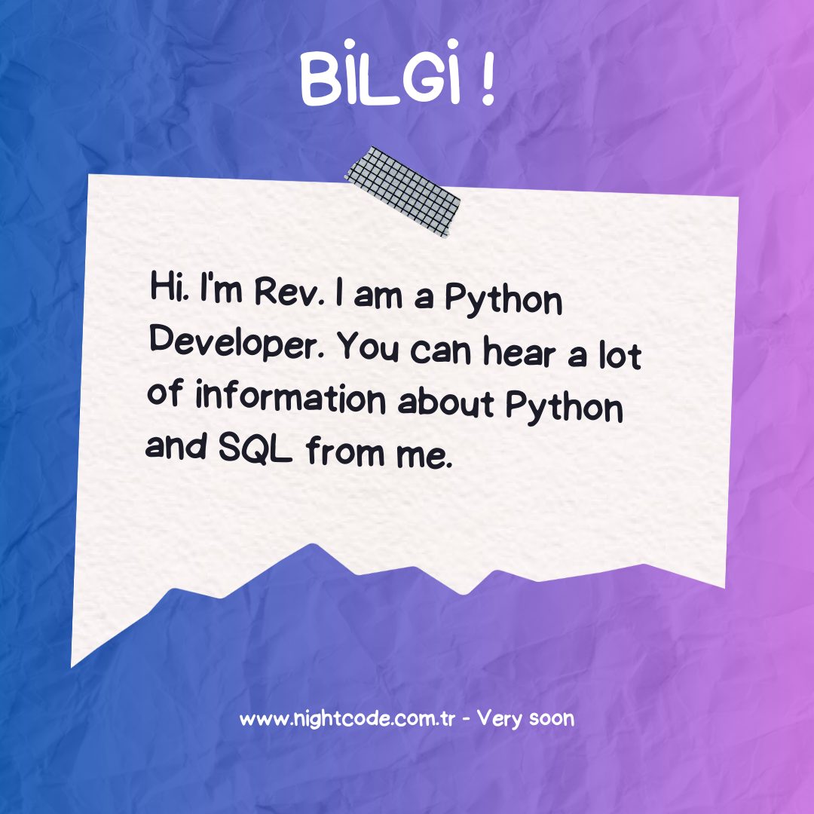

### Hi I'm Rev

> Who is Hi Rev?

# Ben Kimim

  

> :innocent: :Kadir İris Yanı @myrev. Öncelikle Neden myrev :D "Revolka" Yani Doğu Efsanesine Göre Savaşçı, Cesur Demek.
> My Ben Demek Oluyor Yani Ben Revolka Yani Sanal Alemin Revolkası Demek 	:innocent:
* Kadir İris Kimdir?
  > Kadir İris Kod Dünyasına 2023 Yılı İtibariyle Girmiş Ve kendini Bu Konuda Geliştirmeye Çalışan Phyton Geliştiricisi.
* Amacı Nedir
  >  Amacı Kendi Geliştirdiği Kodları Piyasaya Sürerek Bir Piyasa Programcısı Olabilmek.
* Neler Yapar / Yapmak İster?
  > Temel Hedefi SQL İle Veri Tabanı Saklayarak Masaüstü Ve Web Tasarımları Yapabilmek.

> Notlar :)

> [!NOTE]
> Biliyormuydun? Night Code Community İle Beraber Çalıp Öğrenebiliriz.

> [!TIP]
> Biliyormuydun? myrev Night Code Comminty İle Arkadaşlarına Yardım Ediyor :)

> [!IMPORTANT]
> Biliyormuydun? Myrev Sizi Tehlikelerden Uzak Tutmak İçin Uyarıyor.

[İnstagram Adresim :)](https://www.instagram.com/irisakadir0/)

[Discord Night Code Commmunity](https:/www.discord.com/nightcodecommunity/)

# Projelerim 

> Consol Programım
> Amacı Günlük Kullanım İçin İşimizi Kolaylaştıracak Ve Zaman Geçirmeyi Sağlayacak Bir Proje
> [Konsol Projesi](https://github.com/myrev0/PHYTON-/tree/main/program)
